```{r setup}
#| include: false
root <- normalizePath(getwd(), mustWork = TRUE)
rev_root <- file.path(root, "results", "prognostico", "revisao")
rev_agg <- file.path(rev_root, "aggregated")
rev_fig <- file.path(rev_root, "figures")
rev_logs <- file.path(rev_root, "logs")
frozen_agg <- file.path(root, "results", "prognostico", "aggregated")

read_rev <- function(x) {
  p <- file.path(rev_agg, x)
  if (!file.exists(p)) stop("Saída obrigatória da revisão ausente: ", p)
  read.csv(p, check.names = FALSE, stringsAsFactors = FALSE)
}
read_frozen <- function(x) {
  p <- file.path(frozen_agg, x)
  if (!file.exists(p)) stop("Resultado congelado obrigatório ausente: ", p)
  read.csv(p, check.names = FALSE, stringsAsFactors = FALSE)
}
fmt <- function(x, d = 2L) formatC(as.numeric(x), digits = d, format = "f", decimal.mark = ",", big.mark = ".")
fmt_pct <- function(x, d = 1L) paste0(fmt(100 * as.numeric(x), d), "%")
tab <- function(x, cap, d = 3L) {
  z <- x
  num <- vapply(z, is.numeric, logical(1))
  z[num] <- lapply(z[num], function(v) ifelse(is.na(v), "—", fmt(v, d)))
  knitr::kable(z, caption = cap, row.names = FALSE)
}

required_rev <- c(
  "cohort_descriptive.csv", "missing_before_after.csv", "sample_size_display.csv",
  "dicionario_preditores.csv", "validation_performance_ci.csv",
  "validation_failure_audit.csv", "validation_final_shrinkage_summary.csv",
  "validation_final_shrinkage_coefficients.csv", "validation_final_equations.txt",
  "validation_shrinkage_metrics_summary.csv", "prediction_intervals_coverage_by_repeat.csv",
  "coefficients_linear_hc3.csv", "diagnostics_assumption_evidence.csv", "cart_leaves.csv",
  "cart_cutpoint_summary.csv", "cart_calibration_validity_summary.csv",
  "sensitivity_resampling_metrics_summary.csv", "baseline_comparisons.csv",
  "sensitivity_scenario_conclusions.csv", "flexible_frozen_comparison_summary.csv",
  "flexible_failure_audit.csv", "flexible_prediction_stability.csv",
  "tripod_ai_checklist.csv", "probast_ai_assessment.csv", "figures_task12_manifest.csv"
)
required_frozen <- c("cart_external_metric_distribution.csv", "frozen_prediction_stability_summary.csv")
required_fig <- c(
  "linear_delta_distribution.png", "linear_observed_predicted.png", "linear_diagnostics.png",
  "linear_coefficients_hc3.png", "logistic_roc_calibration.png", "logistic_coefficients_shrunk.png",
  "stability_repeated_predictions.png", "cart_illustrative_tree.png", "cart_stability.png",
  "sensitivity_comparisons.png", "flexible_clinical_relations.png", "flexible_selection_stability.png"
)
paths <- c(file.path(rev_agg, required_rev), file.path(frozen_agg, required_frozen), file.path(rev_fig, required_fig))
bad <- paths[!file.exists(paths) | file.info(paths)$size <= 0]
if (length(bad)) stop("Artefatos obrigatórios ausentes/vazios: ", paste(bad, collapse = ", "))

manifest <- read.csv(file.path(rev_logs, "manifesto_inicial.csv"), stringsAsFactors = FALSE)
src <- manifest[manifest$artefato == "data/dataset_escoliose_01.xlsx", ]
if (nrow(src) != 1L || !requireNamespace("digest", quietly = TRUE)) stop("Fonte/sha256 não verificável.")
source_sha <- digest::digest(file = file.path(root, src$artefato), algo = "sha256")
if (!identical(source_sha, src$sha256)) stop("Hash da fonte diverge do manifesto.")

cohort <- read_rev("cohort_descriptive.csv")
missing <- read_rev("missing_before_after.csv")
dictionary <- read_rev("dicionario_preditores.csv")
sample_size <- read_rev("sample_size_display.csv")
perf <- read_rev("validation_performance_ci.csv")
shrink <- read_rev("validation_final_shrinkage_summary.csv")
coef_shrunk <- read_rev("validation_final_shrinkage_coefficients.csv")
shrink_cv <- read_rev("validation_shrinkage_metrics_summary.csv")
conformal <- read_rev("prediction_intervals_coverage_by_repeat.csv")
assumptions <- read_rev("diagnostics_assumption_evidence.csv")
cart_leaves <- read_rev("cart_leaves.csv")
cart_cuts <- read_rev("cart_cutpoint_summary.csv")
cart_validity <- read_rev("cart_calibration_validity_summary.csv")
cart_metrics <- read_frozen("cart_external_metric_distribution.csv")
boot_stability <- read_frozen("frozen_prediction_stability_summary.csv")
sens_metrics <- read_rev("sensitivity_resampling_metrics_summary.csv")
comparators <- read_rev("baseline_comparisons.csv")
sens_conclusions <- read_rev("sensitivity_scenario_conclusions.csv")
flex_compare <- read_rev("flexible_frozen_comparison_summary.csv")
flex_fail <- read_rev("flexible_failure_audit.csv")
tripod <- read_rev("tripod_ai_checklist.csv")
probast <- read_rev("probast_ai_assessment.csv")

pr <- function(model, metric) perf[perf$model == model & perf$metric == metric, , drop = FALSE]
cv <- function(model, metric) shrink_cv[shrink_cv$model == model & shrink_cv$metric == metric, , drop = FALSE]
cf <- function(model, term) coef_shrunk[coef_shrunk$model == model & coef_shrunk$term == term, , drop = FALSE]
sr <- function(scenario, model, metric) sens_metrics[sens_metrics$scenario == scenario & sens_metrics$model == model & sens_metrics$metric == metric, , drop = FALSE]

n_raw <- missing$n_bruto[missing$componente == "fluxo" & missing$variavel == "registros brutos"]
n_dedup <- missing$n_deduplicados[missing$componente == "fluxo" & missing$variavel == "após deduplicação"]
n_final <- missing$n_analitico[missing$componente == "fluxo" & missing$variavel == "coorte analítica"]
events <- cohort$contagem[cohort$variavel == "delta_cat" & cohort$nivel == "melhora"]
stopifnot(length(events) == 1L, events == 317L, n_final == 615L)
non_events <- n_final - events; prevalence <- events / n_final
delta <- cohort[cohort$variavel == "delta" & cohort$tipo == "numerica", ]
linear_10pp <- 10 * cf("linear", "correcao_colete")$coefficient_shrunk
or_10pp <- exp(10 * cf("logistic", "correcao_colete")$coefficient_shrunk)
coverage <- weighted.mean(conformal$observed_coverage, conformal$denominator_predictions)
width <- weighted.mean(conformal$mean_width_degrees, conformal$denominator_predictions)
root_cut <- cart_cuts[cart_cuts$scope == "root" & cart_cuts$variable == "correcao_colete", ]

latex_symbol <- c(
  idade="\\mathrm{idade}", imc="\\mathrm{IMC}",
  cifose_toracica="\\mathrm{cifose}", lordose_lombar="\\mathrm{lordose}",
  correcao_colete="\\mathrm{correcao\\ do\\ colete}",
  sexomasculino="I(\\mathrm{sexo=masculino})",
  lenke2="I(\\mathrm{Lenke}=2)", lenke3="I(\\mathrm{Lenke}=3)",
  lenke4="I(\\mathrm{Lenke}=4)", lenke5="I(\\mathrm{Lenke}=5)",
  lenke6="I(\\mathrm{Lenke}=6)", risser1="I(\\mathrm{Risser}=1)",
  risser2="I(\\mathrm{Risser}=2)", risser3="I(\\mathrm{Risser}=3)",
  risser4="I(\\mathrm{Risser}=4)",
  flexibilidaderigido="I(\\mathrm{flexibilidade=rigido})",
  escoliometro_maior_10_graustoracica="I(\\mathrm{escoliometro=toracica})",
  escoliometro_maior_10_grauslombar="I(\\mathrm{escoliometro=lombar})",
  escoliometro_maior_10_graustoracica_lombar="I(\\mathrm{escoliometro=toracica+lombar})"
)
latex_number <- function(x) formatC(abs(x), digits=12, format="fg", flag="#")
latex_rhs <- function(model) {
  z <- coef_shrunk[coef_shrunk$model == model, ]
  intercept <- formatC(z$coefficient_shrunk[z$term == "(Intercept)"], digits=12, format="fg", flag="#")
  z <- z[z$term != "(Intercept)", ]
  pieces <- paste0(ifelse(z$coefficient_shrunk >= 0, "+", "-"), " ",
                   vapply(z$coefficient_shrunk, latex_number, character(1)), "\\,", latex_symbol[z$term])
  groups <- split(pieces, ceiling(seq_along(pieces)/2))
  lines <- c(paste0(intercept, " ", paste(groups[[1]], collapse=" ")),
             vapply(groups[-1], paste, character(1), collapse=" "))
  paste(lines, collapse=" \\\\\n&\\quad ")
}
```

# Sumário executivo

Este relatório documenta desenvolvimento e **avaliação interna**, não validação externa, de modelos prognósticos para adolescentes com escoliose idiopática submetidos a manejo conservador com colete e exercícios S4D. Entre `r n_final` participantes, `r events` (`r fmt_pct(prevalence)`) apresentaram melhora radiográfica de pelo menos 5° em seis meses. A mudança média da maior magnitude de Cobb foi `r fmt(delta$media)`° (DP `r fmt(delta$dp)`°); valores negativos indicam redução.

- Modelo linear principal: R² corrigido por otimismo `r fmt(pr("linear", "r2")$estimate, 3)` (IC95% `r fmt(pr("linear", "r2")$ci_lower, 3)`–`r fmt(pr("linear", "r2")$ci_upper, 3)`) e RMSE `r fmt(pr("linear", "rmse")$estimate)`° (IC95% `r fmt(pr("linear", "rmse")$ci_lower)`–`r fmt(pr("linear", "rmse")$ci_upper)`°).
- Modelo logístico secundário: AUC corrigida `r fmt(pr("logistic", "auc")$estimate, 3)` (IC95% `r fmt(pr("logistic", "auc")$ci_lower, 3)`–`r fmt(pr("logistic", "auc")$ci_upper, 3)`) e Brier `r fmt(pr("logistic", "brier_score")$estimate, 3)`. AUC mede discriminação, não acurácia.
- Na CV interna do procedimento pós-*shrinkage*, o RMSE linear médio foi `r fmt(cv("linear", "rmse")$mean_across_repeats)`° e a inclinação logística `r fmt(cv("logistic", "calibration_slope")$mean_across_repeats, 3)`.
- Nas equações pós-*shrinkage*, dez pontos percentuais adicionais de correção transversal pelo colete corresponderam a `r fmt(linear_10pp)`° em `delta` e OR `r fmt(or_10pp, 2)` para melhora, mantidos os demais preditores. São contrastes pontuais sem IC pós-*shrinkage*. OR não é risco relativo e associação prognóstica não é efeito causal.
- O cenário com Cobb basal reduziu o RMSE interno em `r fmt(sr("primary", "linear", "rmse")$mean_across_repeats - sr("cobb_baseline_augmented", "linear", "rmse")$mean_across_repeats, 3)`°. A coorte e a especificação principal foram preservadas.

O RMSE é erro agregado, não margem individual. A avaliação conformal obteve cobertura interna de `r fmt_pct(coverage, 2)` e largura média de `r fmt(width)`°; isso evidencia incerteza individual substancial, sem constituir intervalo final validado externamente.

## Guia de leitura

O relatório responde a três perguntas diferentes, que não devem ser confundidas:

1. **O que se quer prever?** Uma mudança contínua em graus (`delta`) e, secundariamente, a probabilidade de essa mudança ser de pelo menos −5°.
2. **Como os preditores são combinados?** Regressões linear e logística atribuem um peso a cada preditor; CART forma grupos por divisões sucessivas; a análise flexível permite curvas e interações sob penalização.
3. **Quanto confiar no resultado?** Desempenho aparente descreve os mesmos dados usados no ajuste. Bootstrap e validação cruzada interna estimam o otimismo e a sensibilidade à amostra. Somente dados independentes poderão testar transportabilidade.

Ao longo do texto, **desenvolvimento** significa construir a equação; **avaliação interna** significa testar o processo por reamostragem da mesma fonte; **avaliação externa** exigiria outra amostra. Calibração pergunta se previsões e observações concordam em nível e escala; discriminação pergunta se o modelo ordena pessoas com resultados diferentes; erro em graus pergunta quão distante a previsão contínua fica do observado.

# Pergunta, cenário e cronologia

A pergunta é: **com informações da avaliação basal, qual mudança na maior magnitude do Cobb e qual probabilidade de melhora radiográfica de pelo menos 5° são esperadas aos seis meses?** O linear em graus é principal; o logístico é secundário; CART e modelagem flexível são exploratórias. Não há limiar de decisão, análise de utilidade ou indicação terapêutica. O relato segue TRIPOD+AI [@collins2024_tripod_ai].

| Momento | Informação |
|---|---|
| Avaliação basal/anamnese | Dez preditores, inclusive correção transversal pelo colete. |
| Momento da previsão | Todos são tratados como disponíveis; a especificação histórica foi explorada antes do congelamento e não é chamada de “a priori”. |
| Seguimento | Manejo conservador com colete e exercícios S4D; adesão e concomitantes não documentados. |
| Horizonte nominal | Maior Cobb aos seis meses; marco exato e intervalo real não documentados. |

`correcao_colete` compara momentaneamente a curvatura sem e com colete rígido na anamnese. É possível marcador de maleabilidade/corrigibilidade imediata ou componente redutível. Estudos com outros protocolos apoiam o racional, mas não validam fórmula, coeficiente ou manutenção local [@ohrt_nissen2016_brace_flexibility]. Não implica ausência de estrutura, efeito causal nem garantia de correção sustentada.

> **Texto para o manuscrito — objetivo.** Desenvolver e avaliar internamente um modelo linear para mudança do maior Cobb aos seis meses e um modelo logístico secundário para melhora radiográfica de pelo menos 5°, mantendo CART e formas flexíveis como explorações.

# Coorte

O fluxo foi de `r n_raw` registros para `r n_dedup` participantes após três duplicatas confirmadas e `r n_final` casos completos após excluir três participantes (`r fmt(3/n_dedup*100, 3)`%) com Lenke ausente. A baixa fração não prova ausência de viés. Não há IDs ou linhas individuais neste documento.

```{r}
knitr::kable(data.frame(Etapa=c("Registros lidos","Após deduplicação","Caso completo"), n=c(n_raw,n_dedup,n_final), Exclusão=c("—","3 duplicatas","3 com Lenke ausente")), caption="Fluxo agregado da coorte.", row.names=FALSE)
```

```{r}
x <- cohort[cohort$tipo == "numerica", c("rotulo","n","media","dp","mediana","q1","q3","minimo","maximo")]
names(x) <- c("Variável","n","Média","DP","Mediana","Q1","Q3","Mínimo","Máximo")
tab(x, "Descrição das variáveis numéricas.", 2)
```

```{r}
x <- cohort[cohort$tipo == "categorica", c("rotulo","nivel","contagem","proporcao")]; x$proporcao <- 100*x$proporcao
names(x) <- c("Variável","Nível","n","%")
tab(x, "Preditores categóricos e desfecho binário.", 1)
```

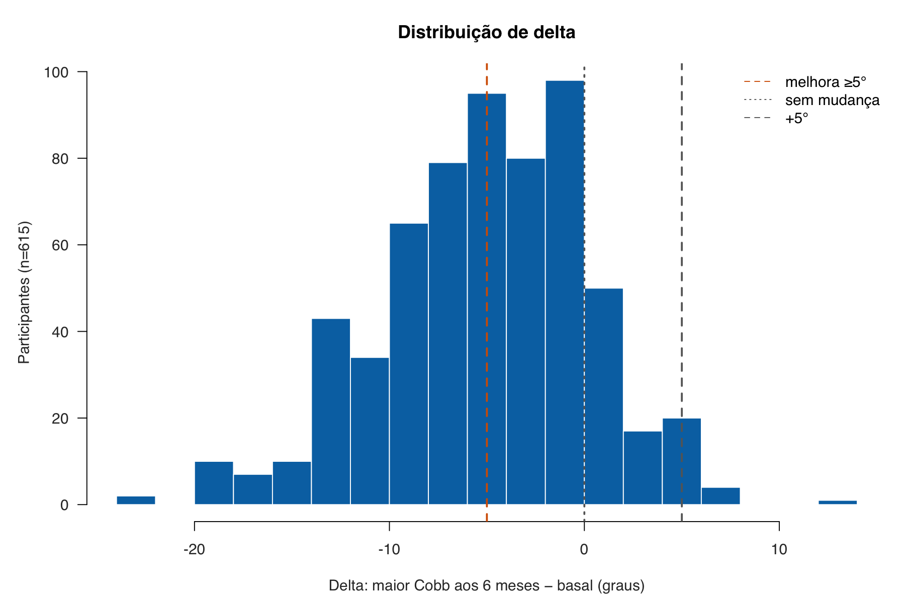{fig-alt="Histograma de delta com marcas em menos cinco, zero e mais cinco graus." width="100%"}

Permanecem ausentes recrutamento, elegibilidade, perdas antes da planilha, centro(s), período, protocolo radiográfico, avaliadores, confiabilidade, adesão, detalhes do colete e intervalo real.

# Desfechos e preditores

$$\Delta = \max(\mathrm{Cobb}_{6\ meses}) - \max(\mathrm{Cobb}_{basal}).$$

O máximo basal usa três regiões e preserva dez empates; o dado final contém só a maior magnitude, sem identificar a região. O evento secundário é `delta <= -5°`. É **melhora radiográfica**, não necessariamente clínica; 5° está na ordem da variabilidade de mensuração manual discutida pela SOSORT, sem estabelecer benefício funcional [@negrini2018_sosort].

Nos empates, conservam-se todas as regiões empatadas; somente o valor máximo entra em `delta`. A comparação entre máximos, mesmo de regiões distintas, foi aprovada pela equipe. O plano registra a mesma condição radiográfica no basal e no seguimento; faltam os detalhes dessa condição, dos avaliadores e da confiabilidade. A correção pelo colete permanece uma medida transversal basal confirmada. Sua fórmula percentual de aquisição não pode ser reconstruída integralmente da planilha; o valor percentual fornecido é utilizado sem truncar as hipercorreções verdadeiras.

```{r}
x <- dictionary[,c("rotulo","definicao_operacional","unidade","codificacao_forma","referencia","graus_liberdade","aquisicao_momento")]
names(x) <- c("Preditor","Definição","Unidade","Forma","Referência","gl","Momento")
knitr::kable(x, caption="Dicionário dos dez preditores.", row.names=FALSE)
```

Correção pelo colete e `flexibilidade` categórica não são sinônimos. O teste/limiar que produz flexível/rígido não está documentado; não se afirma independência conceitual ou valor incremental.

# Métodos

## Especificação e tamanho amostral

### Como as decisões foram tomadas

A sequência decisória foi deliberadamente conservadora:

1. A análise histórica já continha dez preditores. Depois da revisão do objetivo, essa lista foi **congelada** para evitar escolher variáveis novamente com base nos resultados que seriam relatados.
2. `delta` foi mantido como desfecho principal porque preserva a quantidade de mudança em graus. A dicotomização em melhora de pelo menos 5° perde informação e, por isso, ficou secundária.
3. O linear e o logístico usam os mesmos cinco preditores numéricos e cinco categóricos: 19 parâmetros preditores mais intercepto. Categorias como Lenke e Risser viram indicadores, sem presumir distância constante entre níveis.
4. Cobb basal não entrou no principal por preservação procedimental da fórmula histórica; sua plausibilidade clínica motivou uma sensibilidade pré-definida. O ganho observado não foi usado para rebatizar a alternativa como principal.
5. CART e formas flexíveis respondem se relações não lineares, interações ou regras de grupo poderiam acrescentar informação. Como são mais adaptáveis e mais propensas a ajustar ruído, permaneceram exploratórias e foram avaliadas com tuning aninhado.

A especificação, portanto, foi congelada **após** exploração histórica e não é chamada de “a priori”. Não foram reintroduzidos progressão, seleção por p-valor ou divisão treino–teste simples.

### Como as regressões produzem uma previsão

No modelo linear, cada coeficiente é a mudança esperada em `delta` para uma unidade adicional do preditor, mantendo os demais constantes. Os termos são somados ao intercepto. Para uma categoria, o coeficiente compara aquele nível com a referência. Um coeficiente negativo é favorável neste estudo porque `delta` mais negativo significa maior redução radiográfica.

No modelo logístico, a mesma soma é feita na escala de *log-odds*. A transformação $p=1/(1+e^{-\eta})$ converte o resultado em probabilidade entre 0 e 1. Exponenciar um coeficiente produz uma *odds ratio*; ela compara chances, não riscos, e pode parecer numericamente maior que o risco relativo quando o evento é frequente.

```{r}
x <- sample_size[,c("modelo","classe","cenario","valor_desempenho","parametros","n_minimo","participantes_disponiveis","margem_n","suficiente")]
names(x) <- c("Modelo","Classe","Cenário","Premissa","Parâmetros","n mínimo","Disponíveis","Margem","Suficiente")
tab(x, "Tamanho amostral, condicional às premissas.", 3)
```

Os cenários usam *shrinkage* desejado 0,90 [@riley2019_continuous_sample_size; @riley2019_binary_sample_size; @riley2020_sample_size_framework]. R² esperado 0,20 exigiria 676; 60% do Cox–Snell aparente, 654. Portanto, n=615 não é declarado universalmente suficiente nem justifica o flexível.

O cálculo de tamanho amostral não é um teste aprovado/reprovado. Ele pergunta quantas pessoas seriam necessárias sob determinada força de sinal esperada para limitar sobreajuste, manter pequeno o otimismo e estimar o nível médio do desfecho com precisão. Como a força de sinal verdadeira era incerta, foram mostrados cenários; alguns cabem em 615 e outros não.

## Pressupostos e inferência

```{r}
x <- assumptions[,c("assumption","evidence","interpretation","action","limitation")]
x$action[x$assumption == "media_condicional_linear"] <- "Confrontar os diagnósticos apresentados com a análise flexível exploratória, preservando o principal."
x$action[x$assumption == "linearidade_no_logit"] <- "Interpretar os diagnósticos de forma e a calibração; preservar a especificação logística principal."
x$action[x$assumption == "influencia"] <- "Sensibilidades executadas com exclusões somente no treinamento; todos os participantes permanecem no principal."
x$limitation[x$assumption == "influencia"] <- "As sensibilidades relatadas não redefinem a coorte nem justificam exclusões automáticas."
names(x) <- c("Pressuposto","Evidência","Interpretação","Ação","Limite")
knitr::kable(x, caption="Diagnósticos e consequências práticas.", row.names=FALSE)
```

Breusch–Pagan=36,004 (19 gl; p=0,0105), R² auxiliar=0,0585 e razão de DP por quintil=1,265 indicam heteroscedasticidade. IC lineares HC3 usam t com 595 gl [@white1980_robust_covariance; @mackinnon1985_hc3]; corrigem incerteza de coeficientes, não forma/calibração/previsão individual. Posto 20/20, GVIF ajustado 1,047–1,381 e índice de condição máximo 5,723 não aprovam globalmente a especificação. Programação quadrática não detectou separação logística completa/quase-completa [@albert1984_logistic_separation].

Heteroscedasticidade significa que a dispersão dos erros não é igual em toda a faixa prevista. Isso pode tornar erros-padrão clássicos inadequados, razão para usar HC3 como sensibilidade. Colinearidade significa que preditores carregam informação sobreposta e pode deixar coeficientes instáveis; posto, GVIF e índices de condição não mostraram sinal numérico forte, mas também não provam validade clínica. Separação ocorre quando uma combinação de preditores distingue perfeitamente o evento e pode fazer coeficientes logísticos divergir; ela não foi detectada aqui.

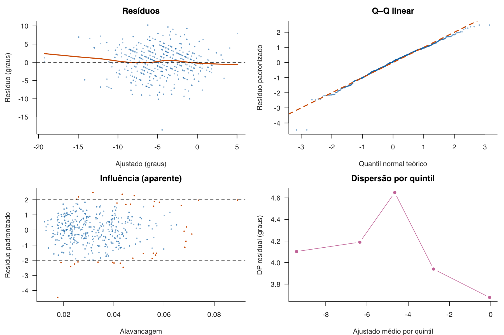{fig-alt="Resíduos, Q-Q, influência e dispersão residual." width="100%"}

## Avaliação interna, *shrinkage* e incerteza

### Bootstrap passo a passo

Cada uma das 2.000 réplicas bootstrap sorteou 615 participantes **com reposição**. Algumas pessoas aparecem mais de uma vez e outras ficam de fora daquela réplica. Em cada repetição: (1) o modelo foi reajustado na amostra bootstrap; (2) seu desempenho foi medido nessa mesma amostra; (3) o mesmo modelo foi aplicado à coorte original; e (4) a diferença estimou quanto o ajuste parecia melhor nos dados que o construíram. A média dessas diferenças é o otimismo [@steyerberg2001_bootstrap].

Para R²/AUC, maior é melhor e a correção reduz o valor aparente; para RMSE/MAE/Brier/*log loss*, menor é melhor e a correção aumenta o erro aparente. Houve 2.000 réplicas válidas e zero falhas por modelo. Os IC principais usam percentis deslocados pela correção de otimismo [@noma2021_optimism_ci]; IC de calibração ficaram indisponíveis porque a estatística aparente é fixa por construção e produziria intervalo artificialmente degenerado.

Esses IC são aproximações para o desempenho da especificação fixa reajustada na população representada, condicionais às decisões já congeladas. O deslocamento não reestima toda a variabilidade do otimismo em uma segunda camada bootstrap e sua cobertura nesta coorte não foi demonstrada por simulação. A exploração histórica que precedeu o congelamento não foi repetida: a correção não cobre o otimismo de toda a estratégia histórica de escolha de desfechos e preditores. Os IC não se referem à equação pós-*shrinkage* nem a previsões individuais.

### *Shrinkage*, calibração e validação cruzada

*Shrinkage* reduz todos os coeficientes não interceptais na direção de zero quando há sinal de sobreajuste. Aqui, o multiplicador foi a inclinação de calibração corrigida: `r fmt(shrink$shrinkage_factor[shrink$model=="linear"],4)` no linear e `r fmt(shrink$shrinkage_factor[shrink$model=="logistic"],4)` no logístico. Depois, o intercepto foi recalibrado para preservar a média de `delta` ou a prevalência. A operação tende a moderar previsões extremas; não cria informação nova e não substitui teste externo.

A validação cruzada estratificada dividiu a coorte em dez partes: nove treinaram e uma avaliou. Isso se repetiu até cada parte servir como teste e todo o ciclo foi repetido cinco vezes. Para avaliar honestamente o procedimento pós-*shrinkage*, o fator e o intercepto foram estimados apenas dentro do treinamento. As amplitudes entre cinco repetições mostram dependência da partição, não IC.

Cada treinamento estimou o fator com 200 réplicas bootstrap por modelo: 20.000 ajustes internos válidos nos 50 folds. A avaliação representa o procedimento com amostras de treinamento menores que 615 e 200 réplicas internas, enquanto a equação final usa 615 participantes e fator obtido com 2.000 réplicas. Não é teste independente da equação final fixada. Não houve balanceamento artificial de classes.

Calibração perfeita teria intercepto 0 e inclinação 1. Intercepto diferente de 0 indica previsões globalmente altas/baixas; inclinação abaixo de 1 costuma indicar previsões extremas demais, e acima de 1, pouco extremas. Intervalos conformais separados foram calibrados sem o teste externo e avaliados somente nele [@lei2018_conformal_regression]; sua cobertura continua interna.

No procedimento conformal, 80% do treinamento externo estimou modelo, fator e escala residual; 20% calibrou o quantil dos resíduos absolutos normalizados. As partições foram estratificadas pelo evento. A cobertura apresentada é empírica e interna: não se afirma garantia exata de 95% para esse desenho estratificado, por subgrupo ou fora da população observada. Permanecem indisponíveis tanto o IC da média quanto o intervalo individual da equação final ajustada nos 615 participantes.

# Modelo contínuo principal

```{r}
x <- perf[perf$model=="linear" & perf$metric %in% c("r2","rmse","mae"),c("metric","apparent","estimate","ci_lower","ci_upper","unit")]
x$metric <- c(r2="R²",rmse="RMSE",mae="MAE")[x$metric]; names(x) <- c("Métrica","Aparente","Corrigida","IC95% inf.","IC95% sup.","Unidade")
tab(x, "Desempenho linear da especificação fixa.", 3)
```

Na CV do procedimento pós-*shrinkage*, o intercepto de calibração médio foi `r fmt(cv("linear","calibration_intercept")$mean_across_repeats,3)`° e a inclinação `r fmt(cv("linear","calibration_slope")$mean_across_repeats,3)`. O RMSE corrigido de `r fmt(pr("linear","rmse")$estimate)`° é agregado e não classifica previsões individuais.

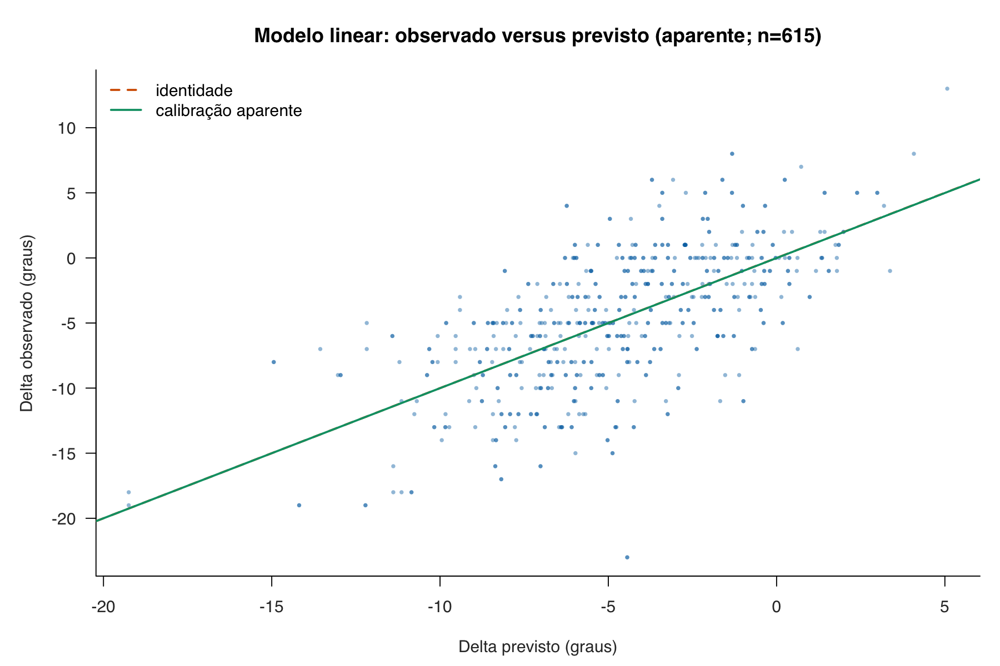{fig-alt="Delta observado versus previsto." width="100%"}

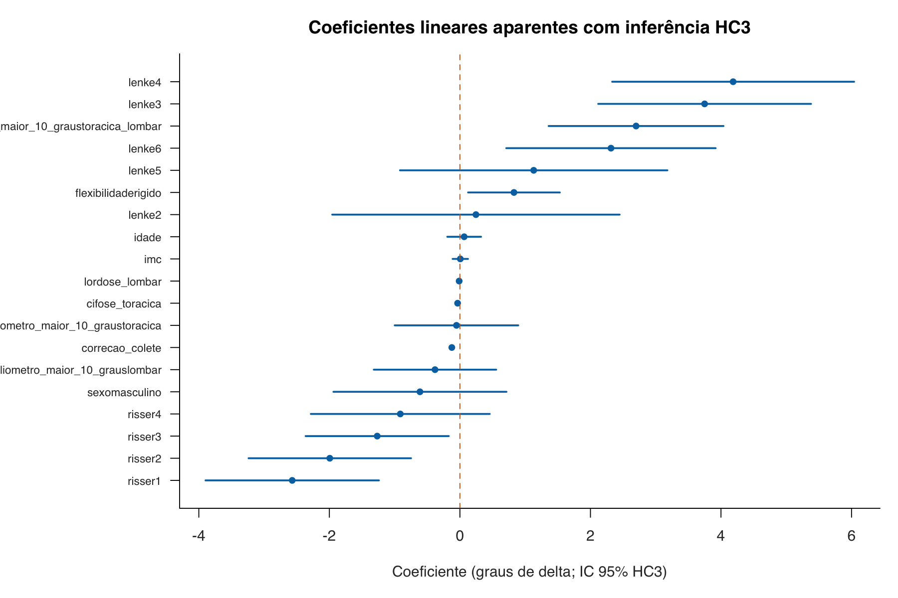{fig-alt="Coeficientes lineares e intervalos robustos." width="100%"}

Na equação pós-*shrinkage*, dez pontos percentuais adicionais de correção pelo colete correspondem a `r fmt(linear_10pp)`° em `delta`, mantidos os demais preditores. Esse contraste não usa os coeficientes aparentes da figura HC3 acima. O sinal favorável não prova que aumentar a correção cause melhor desfecho nem garante manutenção.

# Modelo logístico secundário

```{r}
x <- perf[perf$model=="logistic" & perf$metric %in% c("auc","brier_score","log_loss"),c("metric","apparent","estimate","ci_lower","ci_upper","unit")]
x$metric <- c(auc="AUC",brier_score="Brier",log_loss="Log loss")[x$metric]; names(x) <- c("Métrica","Aparente","Corrigida","IC95% inf.","IC95% sup.","Unidade")
tab(x, "Desempenho logístico da especificação fixa.", 3)
```

AUC é ordenação/discriminação, não acurácia. Brier, *log loss* e calibração são lidos conjuntamente [@vancalster2019_calibration]. Na CV pós-*shrinkage*, calibração global média=`r fmt(cv("logistic","calibration_in_the_large")$mean_across_repeats,3)` log-odds e inclinação=`r fmt(cv("logistic","calibration_slope")$mean_across_repeats,3)`. Na equação pós-*shrinkage*, dez pontos percentuais de correção correspondem a OR `r fmt(or_10pp,2)`; OR não é risco relativo e não recebe IC dos coeficientes aparentes.

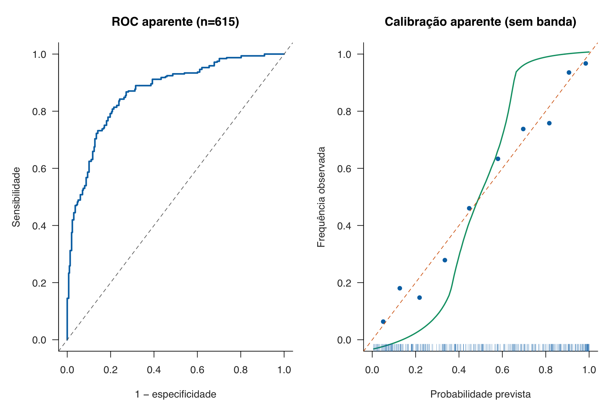{fig-alt="ROC e calibração aparente." width="100%"}

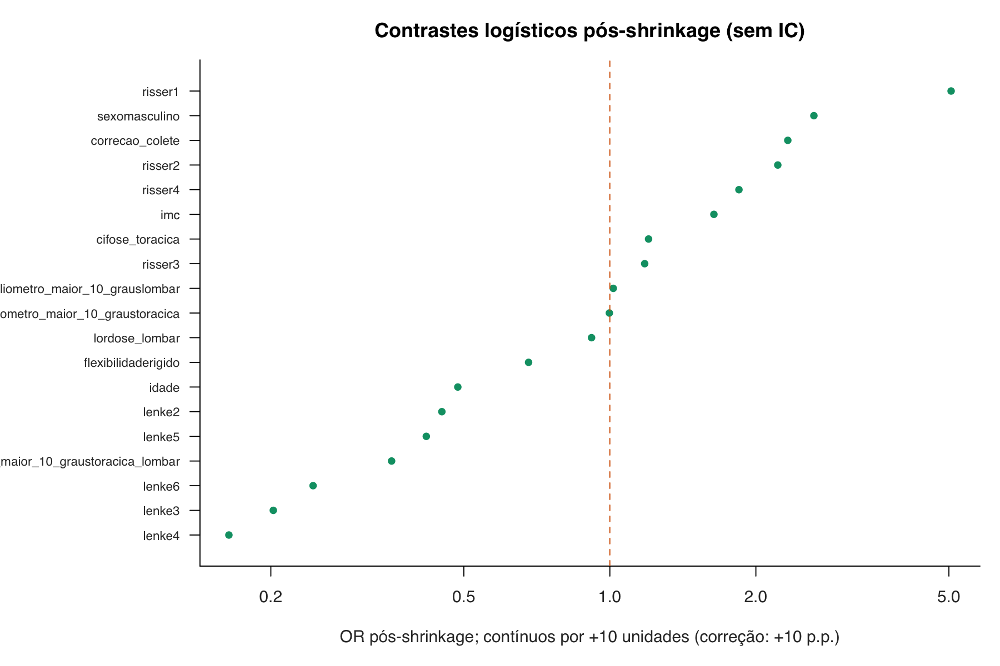{fig-alt="Odds ratios pós-shrinkage." width="100%"}

A amplitude bootstrap mediana foi `r fmt(median(boot_stability$instability_index_95[boot_stability$model=="linear"]))`° no linear e `r fmt(100*median(boot_stability$instability_index_95[boot_stability$model=="logistic"]),1)` pontos percentuais na probabilidade. É instabilidade entre modelos reamostrados, não intervalo de predição.

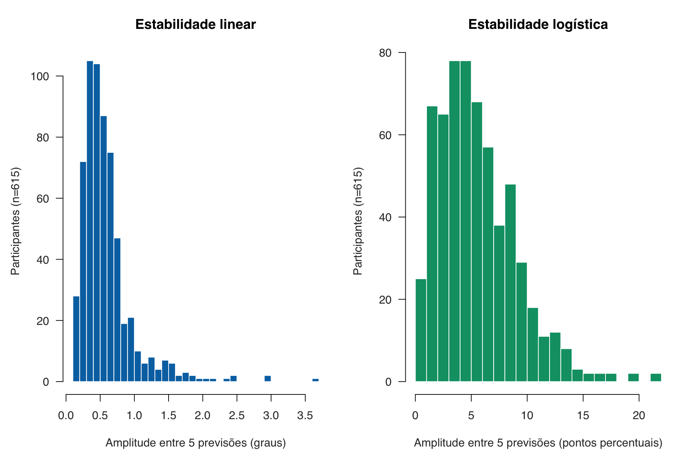{fig-alt="Estabilidade de previsões lineares e logísticas." width="100%"}

# CART exploratória

Uma CART constrói uma sequência de perguntas do tipo “o valor é menor que este corte?”. A cada nó, procura a divisão que mais separa participantes com e sem melhora; as folhas finais contêm grupos com probabilidades aparentes distintas. Essa legibilidade tem custo: pequenas mudanças na amostra podem mudar variável, corte e caminho, por isso desempenho e estabilidade precisam ser avaliados por reamostragem [@breiman1984_cart].

A grade combinou `cp` 0,001/0,005/0,01/0,02, profundidade 1–5 e `minsplit` 10/20/40 (60 configurações). `cp` controla quanto uma nova divisão precisa melhorar a árvore; profundidade limita quantas perguntas podem ocorrer ao longo de um caminho; `minsplit` é o menor nó elegível para tentar uma divisão, não o tamanho mínimo obrigatório de cada folha.

O tuning em cinco folds internos escolheu a maior AUC média e depois aplicou a regra one-SE: entre configurações cujo desempenho era compatível com o melhor dentro de um erro-padrão, preferiu menor profundidade, maior `minsplit` e maior `cp`. Essa regra favorece uma árvore mais simples quando a evidência de ganho é pequena. Os 5 × 10 folds externos pertencem à **CV interna aninhada**: a camada interna escolhe hiperparâmetros; a externa estima desempenho sem reutilizar o fold de teste para escolher a árvore [@cawley2010_nested_cv].

```{r}
x <- cart_metrics[,c("metric","n","mean","sd","median","q025","q975")]
x$metric <- c(auc="AUC",brier_score="Brier",log_loss="Log loss",calibration_intercept="Intercepto",calibration_slope="Inclinação")[x$metric]
names(x) <- c("Métrica","Folds válidos","Média","DP","Mediana","P2,5","P97,5")
tab(x, "CART nos folds externos da avaliação interna aninhada; folds não são independentes.", 3)
```

O intercepto de calibração teve 49/50 folds válidos; um ajuste numericamente inválido foi excluído somente dessa métrica. Cada repetição contém 615 previsões; 3.075 linhas combinadas são cinco previsões por pessoa, não 3.075 pessoas.

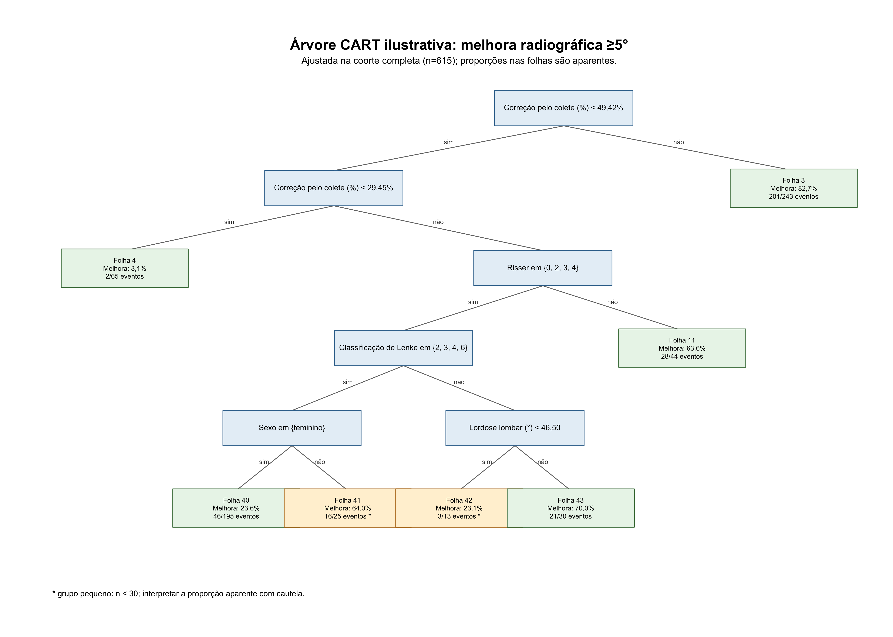{fig-alt="Árvore CART com sete folhas." width="100%"}

```{r}
x <- cart_leaves[,c("folha","caminho_completo","n","eventos_melhora","proporcao_aparente_melhora","grupo_pequeno_n_menor_30")]; x$proporcao_aparente_melhora <- 100*x$proporcao_aparente_melhora
names(x) <- c("Folha","Regra completa","n","Eventos","% aparente","n<30")
tab(x, "Folhas ilustrativas; proporções aparentes.", 1)
```

Correção pelo colete foi raiz em 50/50 árvores. O corte mediano foi `r fmt(root_cut$median,2)`%, com amplitude `r fmt(root_cut$min,2)`–`r fmt(root_cut$max,2)`%. Estabilidade da variável não valida um corte fixo, causalidade ou manutenção.

A extração percorre os nós de `rpart`, separando a divisão primária das concorrentes e substitutas [@therneau2026_rpart_object]. Foram auditados 313 cortes primários (221 contínuos e 92 categóricos), correspondentes aos 313 nós internos; concorrentes e substitutos não entram nas frequências de cortes primários.

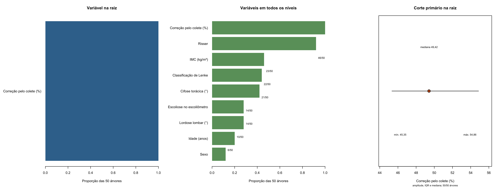{fig-alt="Frequências de variáveis e cortes da raiz." width="100%"}

# Sensibilidades e comparadores

Uma análise de sensibilidade pergunta se a conclusão depende de uma escolha discutível. Ela não serve para escolher retrospectivamente o cenário com melhor resultado. Aqui, cada alternativa foi reajustada no treinamento e avaliada nos mesmos folds completos do principal, tornando as diferenças diretamente comparáveis.

```{r}
x <- data.frame(
  Cenário=c("Principal","Exclusão de influentes apenas no treino","Exclusão de hipercorreções apenas no treino","Acrescido de Cobb basal","Média de delta do treino","Prevalência do treino"),
  Motivação=c("Referência congelada","Investigar sinais de Cook, alavancagem e resíduos","Examinar temporariamente três hipercorreções confirmadas","Condicionar delta ao Cobb basal","Referência contínua simples","Referência binária simples"),
  `n de ajuste`=c("553–555 por partição","linear: 499–509; logístico: 457–479 por partição","550–553 por partição","553–555 por partição","553–555 por partição","553–555 por partição"),
  Avaliação=rep("Mesmas partições de teste completas; 615 previsões por repetição",6),
  Resultado=c(
    paste0("RMSE ",fmt(sr("primary","linear","rmse")$mean_across_repeats,4),"°; Brier ",fmt(sr("primary","logistic","brier_score")$mean_across_repeats,5)),
    paste0("ΔRMSE +",fmt(sr("influence_excluded_train_only","linear","rmse")$mean_across_repeats-sr("primary","linear","rmse")$mean_across_repeats,4),"°; ΔBrier +",fmt(sr("influence_excluded_train_only","logistic","brier_score")$mean_across_repeats-sr("primary","logistic","brier_score")$mean_across_repeats,5)),
    paste0("ΔRMSE +",fmt(sr("hypercorrection_excluded_train_only","linear","rmse")$mean_across_repeats-sr("primary","linear","rmse")$mean_across_repeats,4),"°; mudança de Brier <0,000001"),
    paste0("RMSE ",fmt(sr("cobb_baseline_augmented","linear","rmse")$mean_across_repeats,4),"°; Δ −",fmt(sr("primary","linear","rmse")$mean_across_repeats-sr("cobb_baseline_augmented","linear","rmse")$mean_across_repeats,4),"°"),
    paste0("RMSE ",fmt(sr("training_mean_delta","linear","rmse")$mean_across_repeats,4),"°"),
    paste0("Brier ",fmt(sr("training_prevalence","logistic","brier_score")$mean_across_repeats,5))
  ),
  Conclusão=c("Referência pareada interna","A exclusão diagnóstica piorou a generalização aos testes completos","As três hipercorreções permanecem na coorte principal","Pequeno ganho interno; não redefine o modelo principal","O principal reduziu o erro em graus","O principal reduziu o erro de probabilidade"),
  check.names=FALSE
)
knitr::kable(x, caption="Sensibilidades pareadas nos mesmos testes completos.", row.names=FALSE)
```

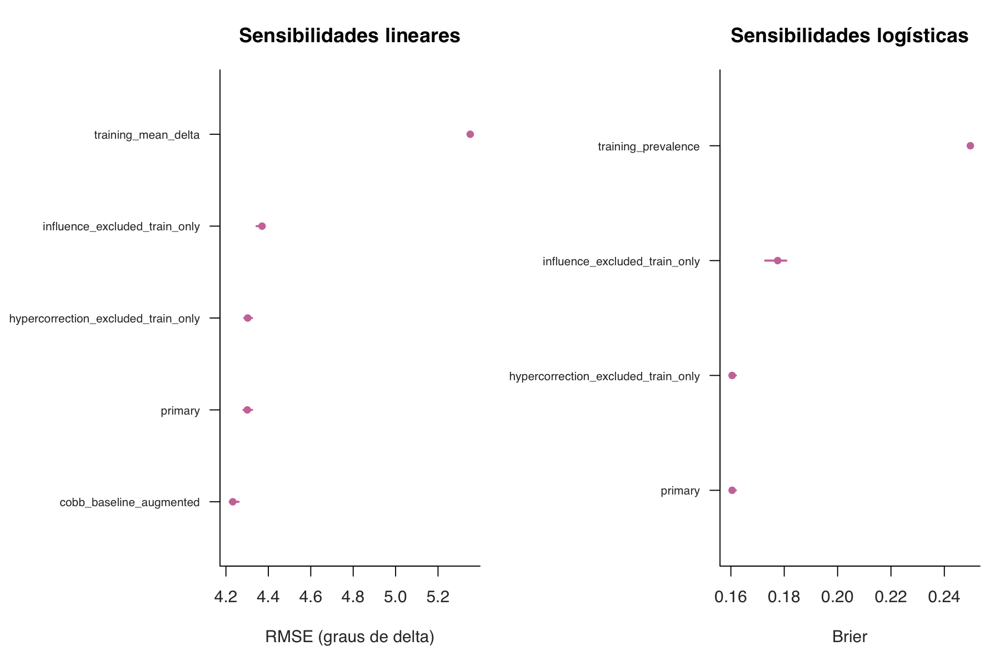{fig-alt="Comparação interna de sensibilidades." width="100%"}

O principal reduziu RMSE em `r fmt(comparators$improvement_error_reduction[comparators$model=="linear" & comparators$model_scenario=="primary"])`° contra a média do treino e Brier em `r fmt(comparators$improvement_error_reduction[comparators$model=="logistic"],3)` contra a prevalência do treino. Excluir sinais influentes piorou desempenho nos testes completos. Retirar temporariamente três hipercorreções verdadeiras mudou RMSE em +0,0019° e Brier em menos de 0,000001; elas permanecem na coorte.

`delta ~ Cobb basal + X` e `Cobb final ~ Cobb basal + X`, reconvertido a `delta`, foram equivalentes (diferenças <1,6e-13). O ganho interno de 0,069° não redefine a especificação e deve ser discutido com acoplamento matemático, regressão à média e erro de mensuração.

# Discussão e conclusão

O sinal mais consistente foi maior correção transversal pelo colete associada a evolução radiográfica mais favorável, compatível com componente redutível, sem inferência causal. A árvore repete essa variável na raiz, mas nenhum corte é uma regra clínica. O desempenho supera referências simples, enquanto RMSE próximo de 4,3° e largura conformal média de 17,4° mostram incerteza individual relevante.

O estudo transversal de Ohrt-Nissen et al. relaciona flexibilidade radiográfica à correção inicial no colete Providence [@ohrt_nissen2016_brace_flexibility]. Já Xu et al. avaliaram retrospectivamente 488 pacientes com pelo menos dois anos de seguimento, usando como sucesso aumento da curva de no máximo 5°, desfecho diferente de redução de pelo menos 5° aos seis meses [@xu2017_initial_correction]. Essas fontes contextualizam corrigibilidade imediata e possível associação longitudinal; não validam os limiares, coeficientes ou a manutenção nesta coorte. Os resultados locais não são extrapolados além de seis meses.

Limitações centrais: fonte única e representatividade desconhecida; informações clínicas/protocolos ausentes; caso completo; erro radiográfico; possível troca da região máxima; especificação posterior à exploração; IC de coeficientes pós-*shrinkage* indisponíveis; equidade e utilidade não avaliadas; nenhuma avaliação externa. A ausência de avaliação externa limita transportabilidade, mas não é por si um julgamento automático do risco de viés da avaliação interna.

Antes de uso, é necessário congelar equação/código, documentar o protocolo, avaliar dados independentes, calibração e equidade, definir manejo de entradas ausentes/fora do domínio e estudar utilidade sob limiares clínicos. PROBAST+AI deve ser aplicado com pergunta explícita e revisão independente [@moons2025_probast_ai].

## Pendências para submissão

O pacote computacional não constitui manuscrito pronto para envio. Os investigadores ainda precisam documentar recrutamento, elegibilidade, centros, período, perdas, marco/janela de seguimento, protocolos de mensuração e tratamento; informar comitê e aprovação ética e consentimento ou dispensa; e declarar financiamento, conflitos, protocolo/registro, disponibilidade de dados/código e envolvimento de pacientes. A ausência dessas informações não demonstra ausência de aprovação ou de procedimentos. O resumo deve ser adaptado à revista, e a comparação com modelos clínicos existentes e as lacunas de equidade devem ser desenvolvidas. Os checklists abaixo discriminam o que está relatado e o que permanece pendente.

> **Texto para o manuscrito — conclusão.** Em 615 adolescentes, o RMSE linear corrigido foi `r fmt(pr("linear","rmse")$estimate)`° e a AUC logística corrigida `r fmt(pr("logistic","auc")$estimate,3)`. Maior correção transversal pelo colete associou-se a maior redução radiográfica, sem causalidade ou garantia de manutenção. Incerteza individual e ausência de avaliação externa impedem uso clínico; CART e flexível permanecem exploratórios.

# Apêndices

## Equações pós-*shrinkage*

As equações usam os coeficientes finais do artefato pós-*shrinkage* e são geradas programaticamente. Para uma pessoa, substituem-se as variáveis numéricas por seus valores e cada indicadora $I(\cdot)$ por 1 quando a categoria é verdadeira e 0 caso contrário. Referências: feminino, Lenke 1, Risser 0, flexível e escoliômetro normal.

```{r}
#| results: asis
cat("$$\\begin{aligned}\n\\widehat{\\Delta} ={}& ", latex_rhs("linear"), "\n\\end{aligned}$$\n\n", sep="")
cat("$$\\begin{aligned}\n\\eta ={}& ", latex_rhs("logistic"), "\\\\\np(\\mathrm{melhora}) ={}& \\frac{1}{1+e^{-\\eta}}\n\\end{aligned}$$\n", sep="")
```

Na equação linear, a saída é `delta` previsto em graus. Na logística, $\eta$ é o preditor linear em *log-odds* e a segunda linha o converte na probabilidade de melhora radiográfica. Os fatores de *shrinkage* foram `r fmt(shrink$shrinkage_factor[shrink$model=="linear"],6)` e `r fmt(shrink$shrinkage_factor[shrink$model=="logistic"],6)`, respectivamente.

## Modelagem flexível corrigida

A análise flexível permite que variáveis numéricas tenham curvas, em vez de obrigá-las a seguir uma reta, e acrescenta interações, nas quais a associação de um preditor pode variar conforme outro. Essa liberdade aumenta capacidade de ajuste, mas também risco de aprender flutuações da amostra.

A candidata teve 48 colunas (6 lineares, 18 bases spline, 14 indicadoras e 10 interações), incluindo Cobb basal. Splines são segmentos polinomiais unidos suavemente que representam curvatura sem impor uma única forma quadrática. A penalização reduz coeficientes para controlar complexidade: `alpha=0` corresponde a ridge, que reduz todos sem zerá-los; `alpha=1` corresponde a lasso, que pode zerar componentes; valores intermediários formam elastic net [@friedman2010_glmnet; @zou2005_elastic_net].

Pré-processamento e tuning ficaram no treino. A regra one-SE minimizou RMSE/*log loss*. Todos os 100 ajustes externos selecionaram ridge. Houve 160/5.000 falhas KKT internas contínuas, tornadas inelegíveis, e nenhuma nos ajustes externos escolhidos. As condições KKT verificam numericamente se a solução satisfaz as condições do ótimo penalizado. Efeitos principais estavam candidatos para todas as interações; a hierarquia forte foi observada nas soluções ridge, não imposta.

```{r}
x <- flex_compare[flex_compare$n_repeats>0 & flex_compare$metric %in% c("rmse","auc","brier_score","log_loss"),c("family","metric","mean_flexible","mean_reference","mean_difference_flexible_minus_reference","min_difference","max_difference")]
names(x) <- c("Família","Métrica","Flexível","Principal","Diferença","Mínimo","Máximo")
tab(x, "Comparação pareada do flexível corrigido; amplitudes não são IC.", 4)
```

Pontos médios favoreceram modestamente o flexível, sem demonstração formal de superioridade; o ganho não isola splines de Cobb basal, interações e penalização. Somente o solver corrigido é consumido.

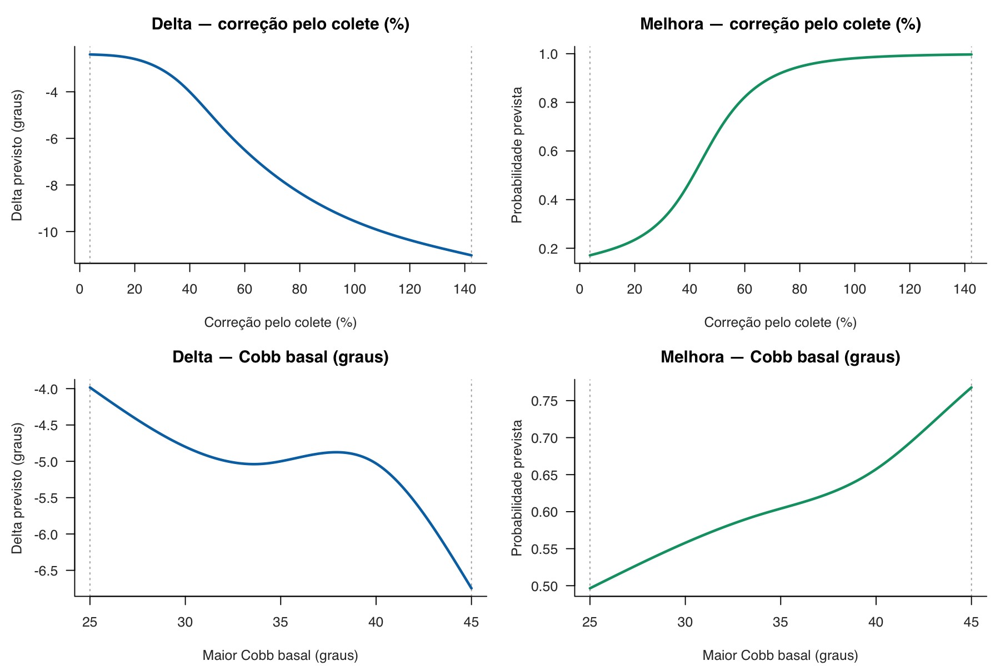{fig-alt="Curvas exploratórias de relações clínicas." width="100%"}

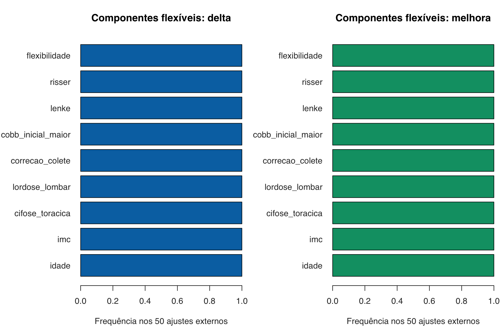{fig-alt="Frequência de componentes flexíveis." width="100%"}

## Cobertura conformal interna

```{r}
x <- conformal; names(x) <- c("Repetição","Folds","Previsões","Nominal","Observada","Largura média (°)","Método","Avaliação")
tab(x, "Cobertura interna; 615 previsões por repetição.", 3)
```

## Checklist TRIPOD+AI

Auditoria local dos itens e subitens oficiais, com localização, evidência e pendência. Os tópicos são rótulos abreviados, não tradução oficial. “Reportado” descreve presença de informação, não validade científica ou conformidade integral [@collins2024_tripod_ai].

```{r}
x <- tripod[,c("item","section","topic","scope","status","location_qmd","evidence_or_pending")]
names(x) <- c("Item","Seção","Tópico","Escopo","Status","Localização","Evidência/pendência")
knitr::kable(x, caption="TRIPOD+AI, versão 7-Feb-2024.", row.names=FALSE)
```

## Auditoria local PROBAST+AI

Pergunta da auditoria: o estudo sustenta desenvolver e avaliar internamente previsões de mudança radiográfica nominal em seis meses, em adolescentes tratados com colete e S4D, para pesquisa? A avaliação separa qualidade do desenvolvimento, risco de viés do desempenho e aplicabilidade. As justificativas e respostas de sinalização são locais e não constituem revisão externa independente [@moons2025_probast_ai]. O risco ligado à exploração histórica não repetida na reamostragem permanece; a ausência de validação externa, isoladamente, não determina alto risco interno.

```{r}
x <- probast[,c("component","domain","assessment_target","draft_judgement","location_qmd","evidence","pending_or_limitation")]
names(x) <- c("Componente","Domínio","Alvo","Preliminar","Localização","Evidência","Pendência/limite")
knitr::kable(x, caption="Rascunho PROBAST+AI 2025.", row.names=FALSE)
```

## Rastreabilidade e sessão

- Fonte congelada `data/dataset_escoliose_01.xlsx`; SHA-256 verificado: `r source_sha`.
- Coorte, diagnósticos, validação adicional, CART estrutural, flexível, sensibilidades e figuras: somente `results/prognostico/revisao/`.
- Baseline explicitamente preservado: desempenho CART e estabilidade bootstrap, ainda válidos em `results/prognostico/aggregated/`.
- Ausência de artefato obrigatório encerra a execução; não há fallback silencioso.

```{r}
cat(paste(capture.output(sessionInfo()), collapse="\n"))
```

# Referências
